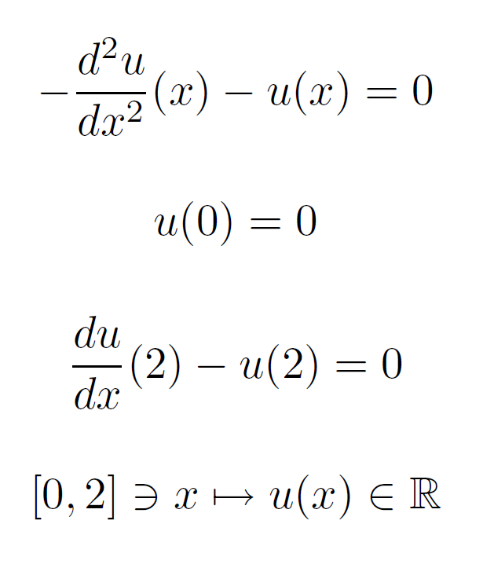
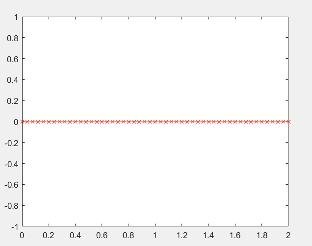
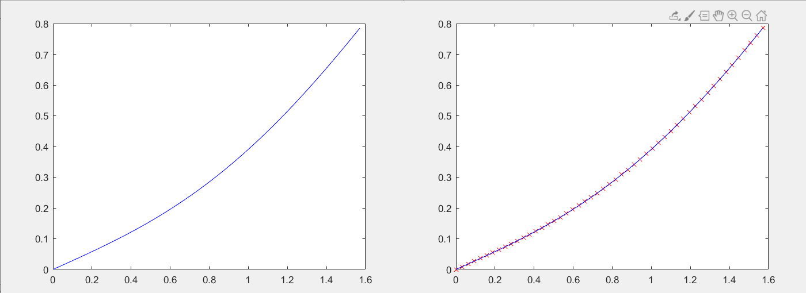

# ProjectDifferentialEquations

Program finds approximate solutions for the second order linear differential equations on the interval [0,k]
Equations are of the form

-(a(x) u'(x))' + b(x) u'(x) + c(x) u(x) = f(x)

with boundary conditions

u(0) = 0

u'(k) - u(k) = 0

Equation proposed in classes:

     
Graph of the solution(constant function):

     

Also here is a graph of the solution to the equation u'' + u = sin(x) on the interval [0, pi / 2]

